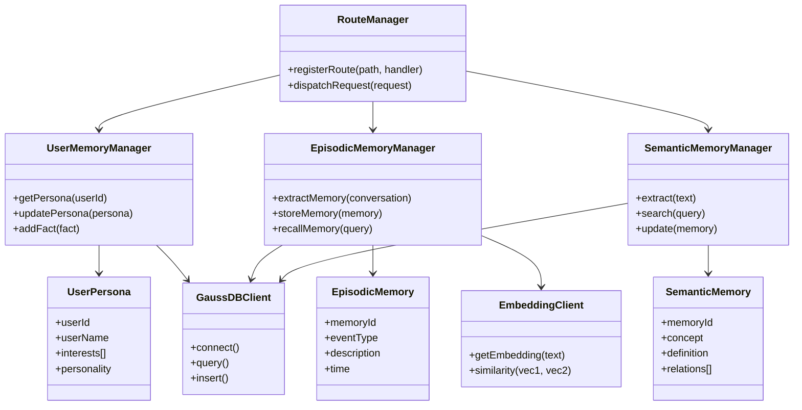

# KMM (Knowledge Memory Management) 需求设计文档

## 文档信息

| 项目名称 | KMM - 知识记忆管理系统 |
|---------|----------------------|
| 文档版本 | v1.0 |
| 创建日期 | 2026-02-28 |
| 项目类型 | 混合语言项目 (C++ + Python) |
| 当前分支 | br_AISF_master_For1220POC |

---

## 目录

1. [项目概述](#1-项目概述)
2. [业务背景](#2-业务背景)
3. [功能需求](#3-功能需求)
4. [非功能需求](#4-非功能需求)
5. [系统架构](#5-系统架构)
6. [4+1架构视图](#6-41架构视图)
7. [业务流程图](#7-业务流程图)
8. [技术选型](#8-技术选型)
9. [数据模型](#9-数据模型)
10. [接口设计](#10-接口设计)
11. [部署方案](#11-部署方案)
12. [测试方案](#12-测试方案)

---

## 1. 项目概述

### 1.1 项目简介

KMM (Knowledge Memory Management) 是一个基于AI的记忆管理系统，为个性化AI助手提供全面的记忆存储、管理和检索能力。系统支持多种记忆类型，能够智能提取、存储和召回用户的情景记忆、语义记忆、核心记忆和程序记忆。

### 1.2 项目目标

- 提供多类型记忆的统一管理平台
- 实现记忆的智能提取和结构化存储
- 支持基于语义和时间的精准记忆召回
- 构建可扩展的AI记忆服务架构
- 支持用户画像的持续更新和优化

### 1.3 适用场景

- 个性化AI助手对话记忆
- 用户行为追踪和分析
- 用户偏好和习惯记录
- 历史事件和经历管理
- 知识库构建和检索

---

## 2. 业务背景

### 2.1 业务痛点

1. **记忆碎片化**：用户与AI的交互记忆分散存储，难以统一管理
2. **检索效率低**：传统基于关键词的检索无法理解语义关系
3. **记忆类型单一**：缺乏对不同类型记忆的分类和管理能力
4. **遗忘机制缺失**：无法根据重要性和时效性自动优化记忆存储
5. **画像更新困难**：用户画像无法随交互动态更新

### 2.2 业务价值

1. **提升AI个性化能力**：通过丰富的记忆库提供更精准的个性化服务
2. **增强用户体验**：记住用户的历史交互和偏好，减少重复输入
3. **支持智能决策**：基于用户历史数据提供智能建议和推荐
4. **保障数据安全**：采用企业级数据库和加密技术保护用户数据

### 2.3 目标用户

- AI助手开发者
- 企业级AI应用
- 个性化推荐系统
- 智能客服系统

---

## 3. 功能需求

### 3.1 核心记忆管理 (Core Memory)

#### 3.1.1 用户画像管理

**功能描述**：管理用户的静态属性和动态特征

**详细需求**：
- 支持用户基础信息存储（姓名、年龄、性别等）
- 支持用户偏好和兴趣标签管理
- 支持用户性格特征和习惯记录
- 支持画像的增量更新和版本管理
- 支持画像冲突检测和解决机制

**优先级**：P0

**验收标准**：
- 支持至少50种用户属性类型
- 画像更新响应时间 < 500ms
- 支持画像查询和导出功能

#### 3.1.2 用户事实管理

**功能描述**：管理用户陈述的事实性信息

**详细需求**：
- 支持用户陈述的事实提取和存储
- 支持事实的真实性验证
- 支持事实的时效性标注
- 支持事实的置信度评分

**优先级**：P1

### 3.2 情景记忆管理 (Episodic Memory)

#### 3.2.1 情景记忆提取

**功能描述**：从用户交互中自动提取情景记忆

**详细需求**：
- 支持多轮对话中的关键事件识别
- 支持事件的时间、地点、人物等要素提取
- 支持事件的情感倾向分析
- 支持事件的重要度评分
- 支持事件的去重和合并

**优先级**：P0

**验收标准**：
- 事件提取准确率 > 85%
- 提取响应时间 < 2s
- 支持批量提取（最多100条）

#### 3.2.2 情景记忆存储

**功能描述**：将提取的情景记忆结构化存储

**详细需求**：
- 支持事件的向量化和索引
- 支持事件的关联关系存储
- 支持事件的元数据管理
- 支持事件的生命周期管理

**优先级**：P0

#### 3.2.3 情景记忆召回

**功能描述**：基于查询条件精准召回相关情景记忆

**详细需求**：
- 支持语义相似度检索
- 支持时间范围筛选
- 支持情感倾向筛选
- 支持重要度排序
- 支持重排序优化

**优先级**：P0

**验收标准**：
- 召回准确率 > 80%
- 召回响应时间 < 1s
- 支持Top-K召回（K可配置）

### 3.3 语义记忆管理 (Semantic Memory)

#### 3.3.1 语义知识提取

**功能描述**：从对话中提取通用知识和概念

**详细需求**：
- 支持实体识别和关系抽取
- 支持知识图谱构建
- 支持知识的分类和标签
- 支持知识的可信度评估

**优先级**：P1

#### 3.3.2 语义知识存储

**功能描述**：管理语义记忆的存储和更新

**详细需求**：
- 支持知识的向量化存储
- 支持知识的层次结构
- 支持知识的版本管理
- 支持知识的冲突解决

**优先级**：P1

#### 3.3.3 语义知识检索

**功能描述**：提供语义知识的检索能力

**详细需求**：
- 支持概念相似度检索
- 支持关系路径查询
- 支持知识推理
- 支持多跳查询

**优先级**：P1

### 3.4 程序记忆管理 (Procedural Memory)

#### 3.4.1 技能和习惯记录

**功能描述**：记录用户的技能和习惯性行为

**详细需求**：
- 支持技能的自动识别和记录
- 支持习惯的模式挖掘
- 支持技能的熟练度评分
- 支持习惯的频率统计

**优先级**：P2

### 3.5 对话管理

#### 3.5.1 对话历史存储

**功能描述**：存储和管理用户与AI的对话历史

**详细需求**：
- 支持多轮对话的完整记录
- 支持对话的上下文关联
- 支持对话的标注和分类
- 支持对话的搜索和检索

**优先级**：P0

**验收标准**：
- 支持至少10000条对话历史
- 对话存储响应时间 < 200ms

#### 3.5.2 对话短记忆

**功能描述**：管理对话中的短期记忆

**详细需求**：
- 支持短记忆的快速提取
- 支持短记忆的时效性管理
- 支持短记忆的自动过期
- 支持短记忆的优先级排序

**优先级**：P1

### 3.6 事件管理

#### 3.6.1 用户事件追踪

**功能描述**：追踪和记录用户的关键事件

**详细需求**：
- 支持事件的自动识别
- 支持事件的分类和标签
- 支持事件的影响范围评估
- 支持事件的传播追踪

**优先级**：P1

#### 3.6.2 事件关联分析

**功能描述**：分析事件之间的关联关系

**详细需求**：
- 支持事件的因果关系分析
- 支持事件的时序分析
- 支持事件的聚类分析
- 支持事件的异常检测

**优先级**：P2

### 3.7 AI智能体管理

#### 3.7.1 智能体调度

**功能描述**：管理多个AI智能体的协调和调度

**详细需求**：
- 支持智能体的注册和发现
- 支持智能体的负载均衡
- 支持智能体的故障转移
- 支持智能体的优先级调度

**优先级**：P0

#### 3.7.2 事件队列管理

**功能描述**：管理智能体的事件队列

**详细需求**：
- 支持事件的入队和出队
- 支持队列的优先级管理
- 支持队列的监控和告警
- 支持队列的持久化

**优先级**：P0

### 3.8 记忆优化

#### 3.8.1 记忆重要性评估

**功能描述**：评估记忆的重要程度

**详细需求**：
- 支持多维度的评分模型
- 支持重要度的动态调整
- 支持重要度的可视化展示
- 支持重要度的批量更新

**优先级**：P1

#### 3.8.2 记忆去重和合并

**功能描述**：识别和合并重复或相似的记忆

**详细需求**：
- 支持基于相似度的去重
- 支持记忆的智能合并
- 支持冲突记忆的标记
- 支持去重结果的审核

**优先级**：P1

#### 3.8.3 记忆遗忘机制

**功能描述**：实现记忆的智能遗忘

**详细需求**：
- 支持基于时效性的遗忘
- 支持基于重要性的遗忘
- 支持基于访问频率的遗忘
- 支持遗忘策略的可配置

**优先级**：P2

---

## 4. 非功能需求

### 4.1 性能需求

| 指标 | 要求 | 备注 |
|-----|------|------|
| 系统响应时间 | < 2s | P95 |
| 并发用户数 | > 1000 | |
| 记忆存储吞吐量 | > 10000条/秒 | |
| 记忆检索吞吐量 | > 5000次/秒 | |
| 向量检索延迟 | < 100ms | Top-10 |
| 数据库查询延迟 | < 50ms | 单表查询 |

### 4.2 可用性需求

| 指标 | 要求 | 备注 |
|-----|------|------|
| 系统可用性 | > 99.9% | |
| 故障恢复时间 | < 5min | |
| 数据备份频率 | 每日一次 | |
| 数据保留期限 | 永久 | |

### 4.3 可扩展性需求

| 指标 | 要求 | 备注 |
|-----|------|------|
| 水平扩展能力 | 支持 | 无状态服务 |
| 垂直扩展能力 | 支持 | |
| 存储扩展能力 | 支持 | 支持TB级 |
| 插件扩展能力 | 支持 | Agent插件化 |

### 4.4 安全性需求

| 指标 | 要求 | 备注 |
|-----|------|------|
| 数据加密 | 支持 | 传输和存储 |
| 访问控制 | 支持 | RBAC |
| 审计日志 | 支持 | 操作可追溯 |
| 防注入攻击 | 支持 | SQL/XSS |
| 敏感数据脱敏 | 支持 | |

### 4.5 兼容性需求

| 指标 | 要求 | 备注 |
|-----|------|------|
| Python版本 | 3.8+ | |
| C++标准 | C++17 | |
| 数据库 | GaussDB 8.0+ | |
| Kubernetes | 1.20+ | |
| 操作系统 | Linux | CentOS 7+ |

### 4.6 可维护性需求

| 指标 | 要求 | 备注 |
|-----|------|------|
| 代码覆盖率 | > 70% | 单元测试 |
| 接口文档 | 完整 | Swagger |
| 日志规范 | 统一 | |
| 监控告警 | 完善 | Prometheus |
| 故障排查 | < 30min | |

---

## 5. 系统架构

### 5.1 整体架构

```
┌─────────────────────────────────────────────────────────────┐
│                        客户端层                               │
│  (Web Client / Mobile Client / Third-party Integration)      │
└─────────────────────────────────────────────────────────────┘
                              │
                              ▼
┌─────────────────────────────────────────────────────────────┐
│                      控制层 (Controller)                      │
│  ┌─────────────────────────────────────────────────────┐   │
│  │              Route Manager (路由管理)                 │   │
│  └─────────────────────────────────────────────────────┘   │
└─────────────────────────────────────────────────────────────┘
                              │
                              ▼
┌─────────────────────────────────────────────────────────────┐
│                    业务逻辑层 (Business)                       │
│  ┌──────────────┐  ┌──────────────┐  ┌──────────────┐      │
│  │ User Memory  │  │ Episodic     │  │ Semantic     │      │
│  │ Manager      │  │ Memory       │  │ Memory       │      │
│  │              │  │ Manager      │  │ Manager      │      │
│  └──────────────┘  └──────────────┘  └──────────────┘      │
│  ┌──────────────┐  ┌──────────────┐  ┌──────────────┐      │
│  │ Core Memory  │  │ Memory Agent │  │ QA Short     │      │
│  │ Manager      │  │ Manager      │  │ Memory       │      │
│  │              │  │              │  │ Manager      │      │
│  └──────────────┘  └──────────────┘  └──────────────┘      │
└─────────────────────────────────────────────────────────────┘
                              │
                              ▼
┌─────────────────────────────────────────────────────────────┐
│                    领域模型层 (Domain)                         │
│  ┌──────────────┐  ┌──────────────┐  ┌──────────────┐      │
│  │ Bean         │  │ Config       │  │ Knowledge    │      │
│  │ (业务对象)    │  │ (配置对象)    │  │ (知识对象)    │      │
│  └──────────────┘  └──────────────┘  └──────────────┘      │
│  ┌──────────────┐  ┌──────────────┐                         │
│  │ DataTable    │  │ ModelAdapter │                         │
│  │ (数据表对象)  │  │ (模型适配器)  │                         │
│  └──────────────┘  └──────────────┘                         │
└─────────────────────────────────────────────────────────────┘
                              │
                              ▼
┌─────────────────────────────────────────────────────────────┐
│                      公共层 (Common)                           │
│  ┌──────────────┐  ┌──────────────┐  ┌──────────────┐      │
│  │ Common Utils │  │ HTTP Helper  │  │ Logger       │      │
│  └──────────────┘  └──────────────┘  └──────────────┘      │
│  ┌──────────────┐  ┌──────────────┐  ┌──────────────┐      │
│  │ JSON Parser  │  │ Snowflake ID │  │ Concurrent   │      │
│  │              │  │ Generator    │  │ Executor     │      │
│  └──────────────┘  └──────────────┘  └──────────────┘      │
└─────────────────────────────────────────────────────────────┘
                              │
                              ▼
┌─────────────────────────────────────────────────────────────┐
│                  基础设施层 (Infrastructure)                   │
│  ┌──────────────┐  ┌──────────────┐  ┌──────────────┐      │
│  │ Database     │  │ Embedding    │  │ Model        │      │
│  │ (GaussDB)    │  │ Service      │  │ Service      │      │
│  └──────────────┘  └──────────────┘  └──────────────┘      │
│  ┌──────────────┐  ┌──────────────┐  ┌──────────────┐      │
│  │ GraphDB      │  │ Python       │  │ Queue        │      │
│  │              │  │ Service      │  │ (消息队列)    │      │
│  └──────────────┘  └──────────────┘  └──────────────┘      │
└─────────────────────────────────────────────────────────────┘
                              │
                              ▼
┌─────────────────────────────────────────────────────────────┐
│                     Python服务层                               │
│  ┌──────────────┐  ┌──────────────┐  ┌──────────────┐      │
│  │ Core Memory  │  │ Episodic     │  │ Semantic     │      │
│  │ Agent        │  │ Memory Agent │  │ Memory Agent │      │
│  └──────────────┘  └──────────────┘  └──────────────┘      │
│  ┌──────────────┐  ┌──────────────┐  ┌──────────────┐      │
│  │ Extract      │  │ Agent        │  │ HTTP Server  │      │
│  │ Agent        │  │ Manager      │  │ (8888端口)    │      │
│  └──────────────┘  └──────────────┘  └──────────────┘      │
└─────────────────────────────────────────────────────────────┘
```

### 5.2 架构设计原则

#### 5.2.1 分层架构
- **Controller层**：负责路由和请求分发
- **Business层**：实现核心业务逻辑
- **Domain层**：定义领域模型和业务对象
- **Common层**：提供公共工具和基础设施
- **Infrastructure层**：封装底层技术组件

#### 5.2.2 依赖倒置原则 (DIP)
- 上层依赖抽象接口，不依赖具体实现
- 使用依赖注入实现解耦
- 接口定义在Domain层，实现在Infrastructure层

#### 5.2.3 单一职责原则 (SRP)
- 每个类只负责一个功能
- 每个模块职责明确
- 避免大而全的设计

#### 5.2.4 开闭原则 (OCP)
- 对扩展开放，对修改关闭
- 使用接口和抽象类支持扩展
- 插件化架构支持功能扩展

### 5.3 通信规范

#### 5.3.1 层间通信
- 上层可以调用下层接口
- 禁止下层直接调用上层
- 使用观察者模式实现反向通信

#### 5.3.2 语言间通信
- C++通过HTTP调用Python服务
- 使用RESTful API进行交互
- JSON格式数据交换

### 5.4 部署架构

```
┌─────────────────────────────────────────────────────────────┐
│                      Kubernetes Cluster                      │
│  ┌─────────────────────────────────────────────────────┐   │
│  │           KMM Service (C++ Service)                  │   │
│  │  - Route Manager                                     │   │
│  │  - Business Logic Layer                              │   │
│  │  - Domain Model Layer                                │   │
│  └─────────────────────────────────────────────────────┘   │
│                              │                               │
│                              ▼                               │
│  ┌─────────────────────────────────────────────────────┐   │
│  │         MemoryService (Python Service)               │   │
│  │  - Core Memory Agent                                 │   │
│  │  - Episodic Memory Agent                             │   │
│  │  - Semantic Memory Agent                             │   │
│  │  - Extract Agent                                     │   │
│  └─────────────────────────────────────────────────────┘   │
│  ┌─────────────────────────────────────────────────────┐   │
│  │              External Services                        │   │
│  │  - LLM Service (Qwen3-32B)                           │   │
│  │  - Embedding Service (Mindie)                        │   │
│  │  - Rerank Service                                    │   │
│  └─────────────────────────────────────────────────────┘   │
│  ┌─────────────────────────────────────────────────────┐   │
│  │              Data Storage                             │   │
│  │  - GaussDB (Vector Database)                         │   │
│  │  - GraphDB (Graph Database)                          │   │
│  └─────────────────────────────────────────────────────┘   │
└─────────────────────────────────────────────────────────────┘
```

---

## 6. 4+1架构视图

4+1架构视图是由Philippe Kruchten提出的软件架构描述方法，通过5个视图来全面描述软件系统的架构。本节将使用4+1视图对KMM系统进行架构说明。

### 6.1 逻辑视图 (Logical View)

逻辑视图描述系统的功能需求，展示系统内部的组件、类、接口及其之间的关系。

#### 6.1.1 核心组件

```
┌─────────────────────────────────────────────────────────────────┐
│                        KMM 系统逻辑架构                           │
└─────────────────────────────────────────────────────────────────┘

┌─────────────────────────────────────────────────────────────────┐
│                     Controller层 (控制层)                         │
│  ┌─────────────────────────────────────────────────────────┐   │
│  │              RouteManager (路由管理器)                     │   │
│  │  - registerRoute()    - dispatchRequest()                │   │
│  │  - handleRequest()    - validateRequest()                │   │
│  └─────────────────────────────────────────────────────────┘   │
└─────────────────────────────────────────────────────────────────┘
                              │
                              ▼
┌─────────────────────────────────────────────────────────────────┐
│                    Business层 (业务逻辑层)                        │
│  ┌──────────────────┐  ┌──────────────────┐  ┌──────────────┐  │
│  │UserMemoryManager │  │EpisodicMemoryMgr │  │SemanticMemory│  │
│  │                  │  │                  │  │Manager       │  │
│  │- getPersona()    │  │- extractMemory() │  │- extract()   │  │
│  │- updatePersona() │  │- storeMemory()   │  │- search()    │  │
│  │- addFact()       │  │- recallMemory()  │  │- update()    │  │
│  └──────────────────┘  └──────────────────┘  └──────────────┘  │
│  ┌──────────────────┐  ┌──────────────────┐  ┌──────────────┐  │
│  │CoreMemoryManager │  │MemoryAgentMgr    │  │QAShortMemory│  │
│  │                  │  │                  │  │Manager       │  │
│  │- update()        │  │- scheduleAgent() │  │- addMemory() │  │
│  │- query()         │  │- dispatchEvent() │  │- recall()    │  │
│  │- evaluate()      │  │- monitorAgents() │  │- expire()    │  │
│  └──────────────────┘  └──────────────────┘  └──────────────┘  │
└─────────────────────────────────────────────────────────────────┘
                              │
                              ▼
┌─────────────────────────────────────────────────────────────────┐
│                     Domain层 (领域模型层)                          │
│  ┌──────────────────┐  ┌──────────────────┐  ┌──────────────┐  │
│  │UserPersona       │  │EpisodicMemory    │  │SemanticMemory│  │
│  │                  │  │                  │  │              │  │
│  │- userId          │  │- memoryId        │  │- memoryId    │  │
│  │- userName        │  │- eventType       │  │- concept     │  │
│  │- interests[]     │  │- description     │  │- definition  │  │
│  │- personality     │  │- time            │  │- relations[] │  │
│  └──────────────────┘  └──────────────────┘  └──────────────┘  │
│  ┌──────────────────┐  ┌──────────────────┐  ┌──────────────┐  │
│  │UserFact          │  │UserConversation  │  │UserEvent    │  │
│  │                  │  │                  │  │              │  │
│  │- factId          │  │- conversationId  │  │- eventId     │  │
│  │- content         │  │- messages[]      │  │- eventType   │  │
│  │- confidence      │  │- sessionId       │  │- timestamp   │  │
│  └──────────────────┘  └──────────────────┘  └──────────────┘  │
└─────────────────────────────────────────────────────────────────┘
                              │
                              ▼
┌─────────────────────────────────────────────────────────────────┐
│                   Infrastructure层 (基础设施层)                    │
│  ┌──────────────────┐  ┌──────────────────┐  ┌──────────────┐  │
│  │GaussDBClient     │  │EmbeddingClient   │  │ModelService  │  │
│  │                  │  │                  │  │              │  │
│  │- connect()       │  │- getEmbedding()  │  │- generate()  │  │
│  │- query()         │  │- batchEmbed()    │  │- chat()      │  │
│  │- insert()        │  │- similarity()    │  │- stream()    │  │
│  └──────────────────┘  └──────────────────┘  └──────────────┘  │
│  ┌──────────────────┐  ┌──────────────────┐  ┌──────────────┐  │
│  │GraphDBClient     │  │PythonService     │  │QueueManager  │  │
│  │                  │  │                  │  │              │  │
│  │- queryGraph()    │  │- callAPI()       │  │- enqueue()   │  │
│  │- addNode()       │  │- asyncCall()     │  │- dequeue()   │  │
│  │- addEdge()       │  │- healthCheck()   │  │- peek()      │  │
│  └──────────────────┘  └──────────────────┘  └──────────────┘  │
└─────────────────────────────────────────────────────────────────┘
                              │
                              ▼
┌─────────────────────────────────────────────────────────────────┐
│                      Common层 (公共层)                            │
│  ┌──────────────────┐  ┌──────────────────┐  ┌──────────────┐  │
│  │CommonUtils       │  │HTTPHelper        │  │Logger        │  │
│  │                  │  │                  │  │              │  │
│  │- formatTime()    │  │- post()          │  │- info()      │  │
│  │- parseJSON()     │  │- get()           │  │- error()     │  │
│  │- validate()      │  │- put()           │  │- debug()     │  │
│  └──────────────────┘  └──────────────────┘  └──────────────┘  │
│  ┌──────────────────┐  ┌──────────────────┐  ┌──────────────┐  │
│  │SnowflakeIDGen    │  │ConcurrentExecutor│  │JSONParser    │  │
│  │                  │  │                  │  │              │  │
│  │- nextId()        │  │- submit()        │  │- parse()     │  │
│  │- parseId()       │  │- shutdown()      │  │- stringify() │  │
│  └──────────────────┘  └──────────────────┘  └──────────────┘  │
└─────────────────────────────────────────────────────────────────┘
```

#### 6.1.2 类关系图



### 

### 6.4 开发视图 (Development View)

开发视图描述系统的软件开发架构，展示代码的组织结构、依赖关系和技术栈。

#### 6.4.1 代码结构

```
KMM/
├── service/                          # C++ 服务
│   ├── include/                      # 头文件
│   │   ├── controller/               # 控制层
│   │   │   └── route_mgr.h
│   │   ├── business/                 # 业务逻辑层
│   │   │   ├── memory/
│   │   │   │   ├── user_memory_manager.h
│   │   │   │   ├── episodic_memory_manager.h
│   │   │   │   ├── semantic_memory_manager.h
│   │   │   │   └── core_memory_manager.h
│   │   │   └── schedule/
│   │   │       └── memory_agent_manager.h
│   │   ├── domain/                   # 领域模型层
│   │   │   ├── bean/
│   │   │   │   ├── user_persona.h
│   │   │   │   ├── episodic_memory.h
│   │   │   │   └── semantic_memory.h
│   │   │   └── config/
│   │   │       └── kmm_config.h
│   │   ├── common/                   # 公共层
│   │   │   ├── common_utils.h
│   │   │   ├── http_helper.h
│   │   │   ├── logger.h
│   │   │   └── json_parser.h
│   │   └── infrastructure/           # 基础设施层
│   │       ├── database/
│   │       │   ├── gaussdb_client.h
│   │       │   └── graphdb_client.h
│   │       ├── embedding/
│   │       │   └── embedding_client.h
│   │       └── model/
│   │           └── model_service.h
│   ├── src/                         # 源文件
│   │   ├── controller/
│   │   ├── business/
│   │   ├── domain/
│   │   ├── common/
│   │   └── infrastructure/
│   └── CMakeLists.txt               # 构建配置
│
├── MemoryService/                   # Python 服务
│   ├── server/                      # HTTP 服务器
│   │   ├── server.py
│   │   └── route.py
│   ├── agent/                       # AI 智能体
│   │   ├── base_agent.py
│   │   ├── core_memory_agent.py
│   │   ├── episodic_memory_agent.py
│   │   ├── semantic_memory_agent.py
│   │   ├── extract_episodic_agent.py
│   │   └── agent_manager.py
│   ├── client/                      # 客户端
│   │   ├── db/
│   │   │   ├── gaussdb_client.py
│   │   │   └── graphdb_client.py
│   │   ├── llm_client.py
│   │   └── embedding_client.py
│   ├── schemas/                     # 数据模型
│   │   ├── core_memory.py
│   │   ├── episodic_memory.py
│   │   └── semantic_memory.py
│   ├── config/                      # 配置
│   │   ├── config.ini
│   │   └── config.py
│   └── requirements.txt             # Python 依赖
│
├── deployment/                      # 部署配置
│   ├── Helm/                        # Helm Chart
│   │   └── aisf05_kmmservice.yaml
│   ├── conf/                        # 配置文件
│   │   ├── kmm_config.json
│   │   ├── database/
│   │   ├── knowledge/
│   │   └── model/
│   └── Dockerfile
│
├── build/                           # 构建脚本
│   ├── local-build.sh
│   ├── compile.sh
│   ├── makeimage.sh
│   └── package.sh
│
└── README.md                        # 项目文档
```

#### 6.4.2 依赖关系

```
┌─────────────────────────────────────────────────────────────────┐
│                        依赖关系图                                │
└─────────────────────────────────────────────────────────────────┘

C++ Service 依赖:
├── UMOMFrmCpp (华为框架)
├── RagSdk (RAG SDK)
├── MateMindSDK (AI SDK)
├── Protobuf
├── OpenSSL
└── C++17 Standard Library

Python Service 依赖:
├── Python 3.8+
├── FastAPI / http.server
├── Pydantic
├── SQLAlchemy
├── psycopg2 (PostgreSQL)
├── requests
├── numpy
└── openai (LLM Client)

构建工具:
├── CMake 3.17+
├── GCC / Clang
├── Docker
├── Helm
└── Kubernetes

运行时依赖:
├── GaussDB 8.0+
├── GraphDB
├── Redis
├── LLM Service (Qwen3-32B)
└── Embedding Service (Mindie)
```

### 6.5 场景视图 (Scenarios View)

场景视图描述系统在特定用例下的行为，展示关键场景的交互流程。

#### 6.5.1 场景1：情景记忆提取与存储

```
参与者: 用户, KMM系统

场景流程:
1. 用户与AI助手进行对话
2. KMM系统接收对话消息
3. 系统调用情景记忆提取Agent
4. Agent分析对话内容，识别关键事件
5. Agent提取事件的时间、地点、人物等要素
6. Agent评估事件的重要度和情感倾向
7. 系统将提取的记忆向量化
8. 系统将记忆存储到GaussDB
9. 系统返回提取结果

前置条件:
- 用户已登录
- 系统正常运行
- 数据库连接正常

后置条件:
- 情景记忆已存储
- 向量索引已更新
- 用户画像已更新
```

#### 6.5.2 场景2：记忆召回

```
参与者: 用户, AI助手, KMM系统

场景流程:
1. 用户向AI助手提问
2. AI助手向KMM系统请求相关记忆
3. 系统将问题向量化
4. 系统在GaussDB中进行向量检索
5. 系统获取Top-K相关记忆
6. 系统调用重排序服务优化结果
7. 系统返回相关记忆列表
8. AI助手基于记忆生成回答
9. 系统记录本次交互

前置条件:
- 用户有历史记忆
- 向量索引已构建
- 检索服务正常

后置条件:
- 返回相关记忆
- 更新访问统计
- 可能触发记忆优化
```

#### 6.5.3 场景3：用户画像更新

```
参与者: 用户, KMM系统

场景流程:
1. 用户在对话中透露新信息
2. 系统识别用户事实
3. 系统调用核心记忆Agent
4. Agent分析事实的可信度
5. Agent检查与现有画像的冲突
6. 系统更新用户画像
7. 系统创建画像版本记录
8. 系统触发相关记忆的关联更新

前置条件:
- 用户画像已存在
- 事实提取正常

后置条件:
- 用户画像已更新
- 版本记录已创建
- 关联记忆已更新
```

### 6.6 视图映射关系

| 视图 | 关注点 | 主要受众 | 输出物 |
|-----|-------|---------|-------|
| 逻辑视图 | 功能结构、类关系 | 架构师、开发人员 | 类图、组件图 |
| 进程视图 | 并发、同步、通信 | 架构师、性能工程师 | 序列图、活动图 |
| 物理视图 | 部署拓扑、资源配置 | 架构师、运维人员 | 部署图、网络图 |
| 开发视图 | 代码结构、依赖关系 | 开发人员、项目经理 | 包图、依赖图 |
| 场景视图 | 用例场景、交互流程 | 产品经理、测试人员 | 用例图、时序图 |

---
